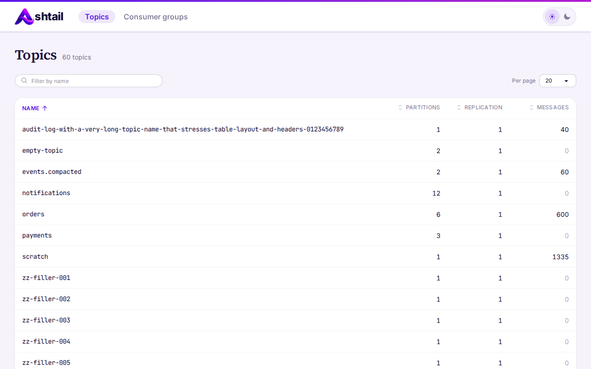
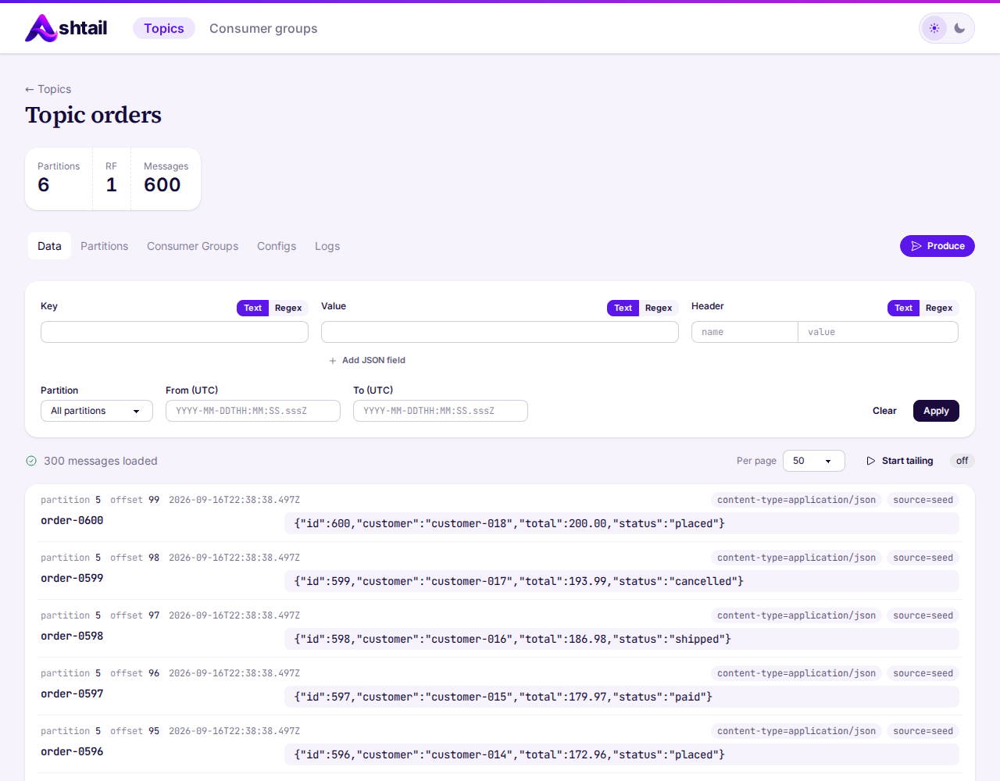
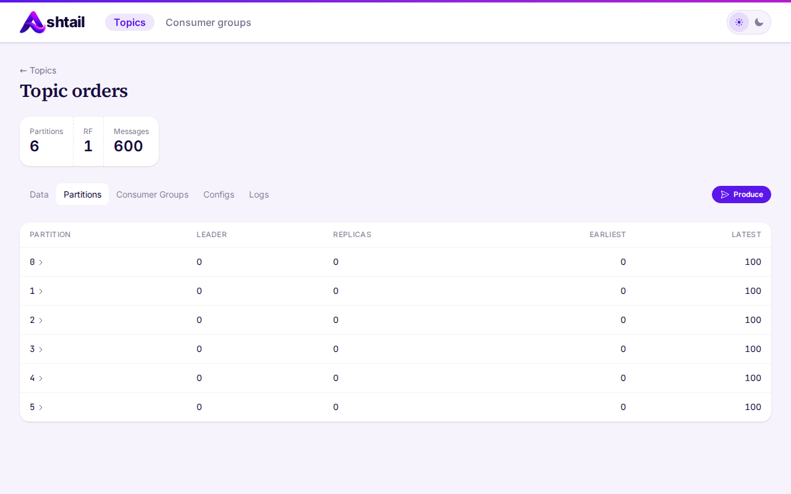
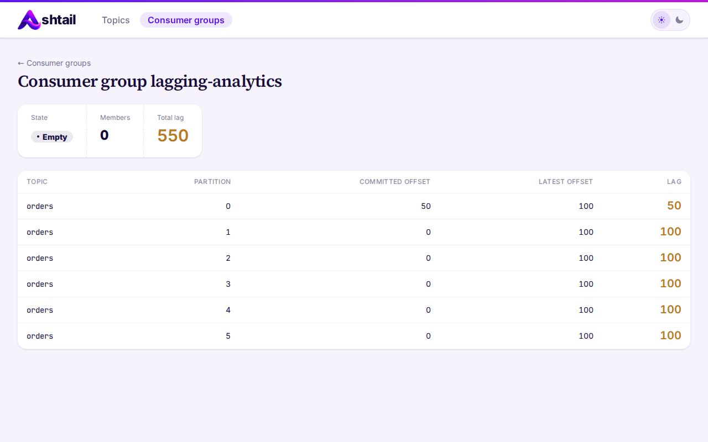
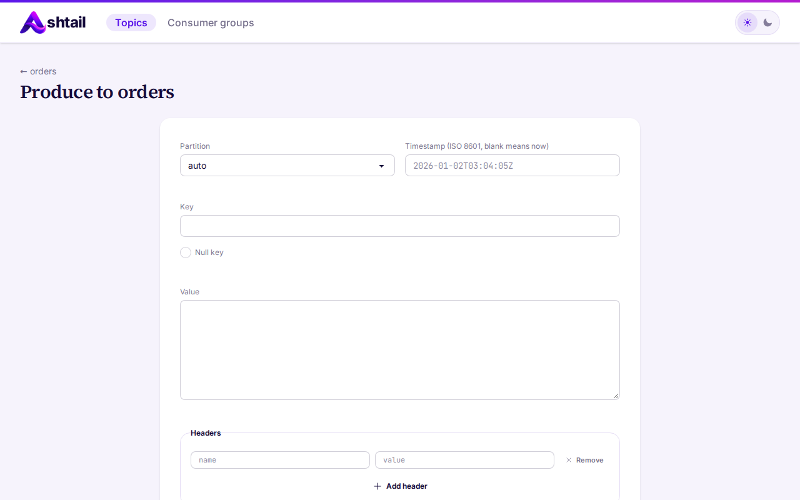

<p align="center">
  <picture>
    <source media="(prefers-color-scheme: dark)" srcset="docs/images/ashtail-wordmark-dark.png">
    
  </picture>
</p>

# Ashtail

A small web UI for poking at a single Kafka cluster while you debug your own
services. It lists topics, shows partitions, offsets, configs and log dirs,
browses and filters messages (including JSON field conditions), tails topics
live, shows consumer group lag, and can produce a single test message.

It has no database. Everything is read live from the broker.

Built with Phoenix 1.8 / LiveView 1.2, [brod](https://github.com/kafka4beam/brod),
Tailwind 4 and daisyUI 5.

## Screenshots

**Topics.** Every topic on the cluster with partition count, replication
factor and message count. Filter by name, sort any column.



**Messages.** Browse a topic newest first. Filter by key, value or header
(text or regex), by JSON field conditions, partition and time range, or start
tailing to watch new messages arrive live.



**Partitions.** Leader, replicas and earliest/latest offsets per partition;
click a partition to browse just its messages.



**Consumer group lag.** Group state, member count and committed vs latest
offset per partition, with lag highlighted.



**Produce.** Send a single test message with a chosen partition, key (or null
key), value, headers and timestamp.



## Quick start

Requirements: Elixir 1.17+, Docker (for the local Redpanda broker), Node.js
(only for the screenshot pass).

```bash
mix setup          # deps, assets, starts Redpanda and seeds fixture data
mix phx.server     # http://localhost:4000
```

`mix setup` runs `mix kafka.seed`, which brings up the Redpanda container from
`docker-compose.yml` (Kafka on `localhost:19092`) and creates the fixture
topics and consumer groups. The seed script is idempotent, so run it as often
as you like.

## Pointing it at a real cluster

The broker is configured from environment variables at boot:

| Variable | Default (dev/test) | Notes |
| --- | --- | --- |
| `KAFKA_BROKERS` | `localhost:19092` | comma-separated `host:port`; required in prod |
| `KAFKA_CLIENT_ID` | `ashtail` | |
| `KAFKA_CONNECT_TIMEOUT_MS` | `5000` | prod default 10000 |
| `KAFKA_REQUEST_TIMEOUT_MS` | `10000` | prod default 30000 |
| `KAFKA_TLS` | `false` | prod default `true` |
| `KAFKA_SASL_MECHANISM` | unset | `plain`, `scram-sha-256` or `scram-sha-512` |
| `KAFKA_SASL_USERNAME` / `KAFKA_SASL_PASSWORD` | unset | used when a mechanism is set |

```bash
KAFKA_BROKERS=broker1:9092,broker2:9092 mix phx.server
```

A bad value fails the boot with a message naming the variable.

### Multiple brokers

`KAFKA_BROKERS` is a bootstrap list: plain `host:port` pairs separated by
commas, with no brackets or quotes around the list. Given more than one entry,
Ashtail falls back to the next broker when the first is unreachable, and every
entry is available for metadata, consumer group listing and message fetches.

Two things to watch for:

- The entries must be brokers of the same cluster. Pointed at two unrelated
  clusters, Ashtail uses whichever one answers first and reports no error.
- Partition, offset and log dir lookups connect directly to each leader or
  replica at the address the cluster advertises to its clients, so those
  advertised hosts and ports must also be reachable from wherever Ashtail runs.
  A containerized cluster that advertises internal names will list topics fine
  and then fail on those views.

One Ashtail instance serves one cluster; multiple clusters are out of scope.

## Checks

```bash
mix precommit      # compile with warnings as errors, format check, credo --strict, tests
mix screenshots    # full-page screenshots of every route into tmp/shots (Playwright)
```

Most tests talk to the seeded local broker, so run `mix kafka.seed` first.

See [docs/ARCHITECTURE.md](docs/ARCHITECTURE.md) for how the pieces fit
together.
